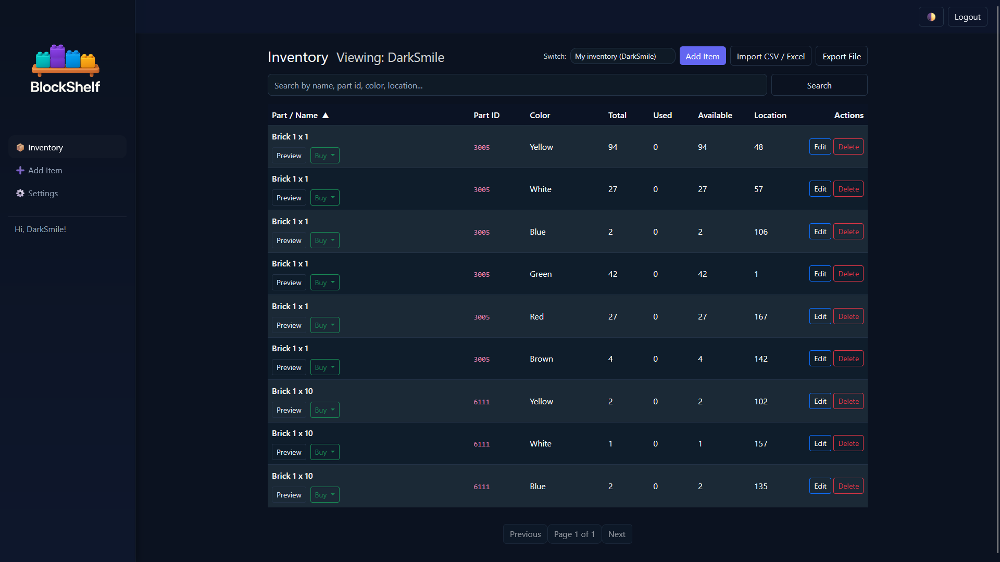
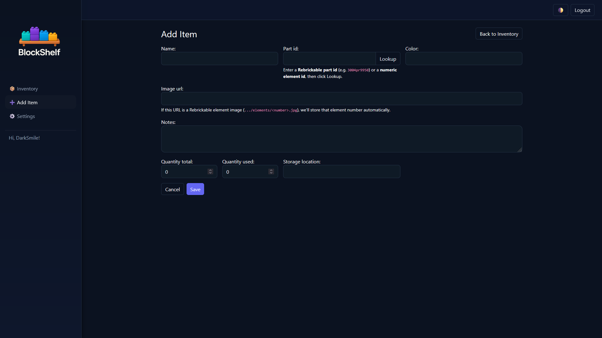
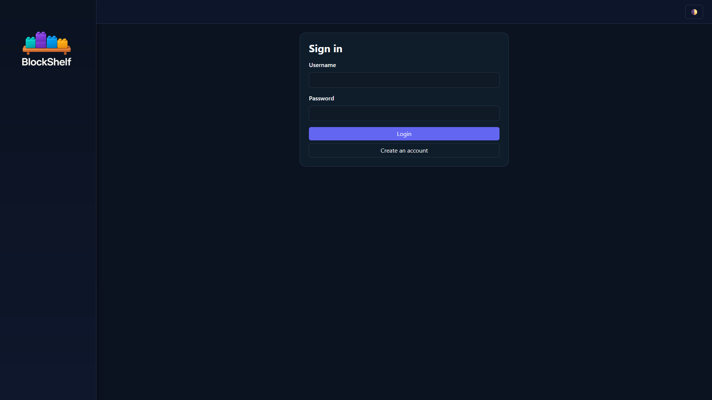
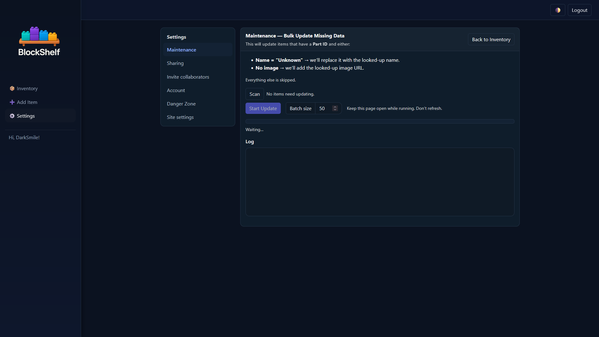
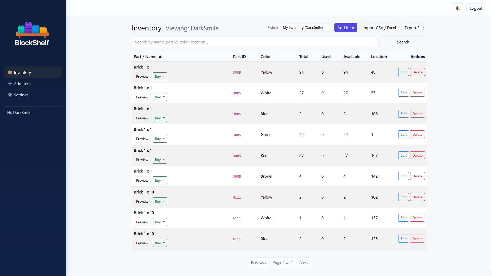
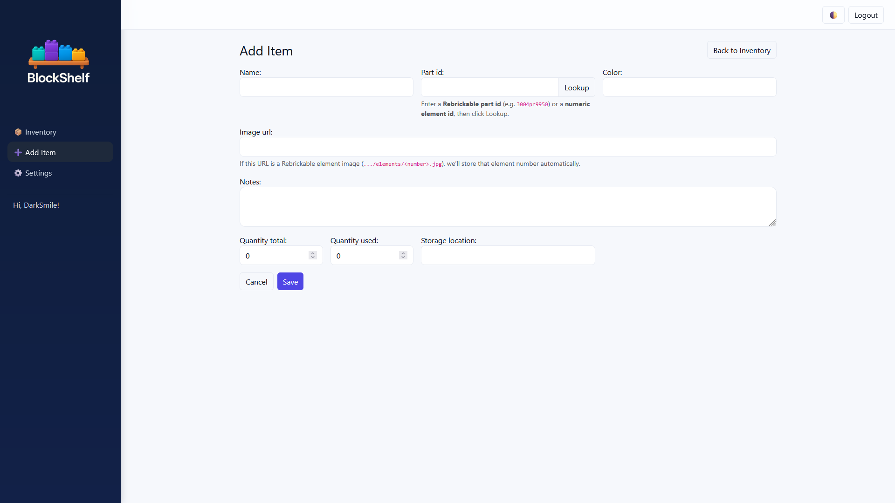
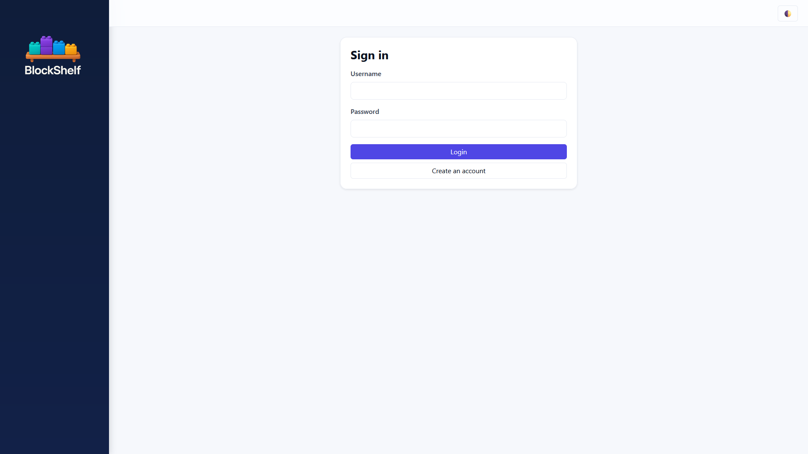
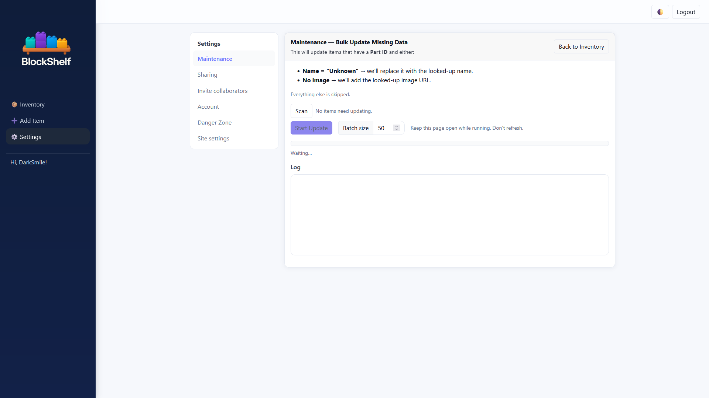

<p align="center">
  
</p>

<h1 align="center">BlockShelf</h1>

<p align="center">
  A clean, local‑first LEGO® parts inventory app — import, search, share, and collaborate.
</p>

---

## ✨ Highlights

- 🔎 <strong>Clean inventory UI</strong> with search, sort, pagination & dark mode
- 📥 <strong>Import</strong> CSV/XLS/XLSX (and export CSV)
- 🧠 <strong>Local‑first part lookups</strong> with Rebrickable API fallback
- 🧩 <strong>Rebrickable Bootstrap</strong>: seed local data from downloads ZIP (<code>colors.csv</code>, <code>parts.csv</code>, <code>elements.csv</code>)
- 🔗 <strong>Share &amp; collaborate</strong>: public links and invitations with permissions

> LEGO® is a trademark of the LEGO Group, which does not sponsor, authorize or endorse this project.

---

## 🚀 Quick Start (Local)

```bash
git clone https://github.com/DarkSmileee/BlockShelf.git
cd BlockShelf

python -m venv .venv
source .venv/bin/activate   # Windows: .venv\Scripts\activate

pip install -U pip
pip install -r requirements.txt

cp .env.example .env
python manage.py migrate
python manage.py createcachetable
python manage.py runserver
```

Optional: create an admin user

```bash
python manage.py createsuperuser
```

---

## 📸 Screenshots

### Dark
<p>
  
  
</p>
<p>
  
  
</p>

### Light
<p>
  
  
</p>
<p>
  
  
</p>

---

## 📄 License

Released under the <strong>PolyForm Noncommercial License 1.0.0</strong> — see <a href="LICENSE">LICENSE</a>.
